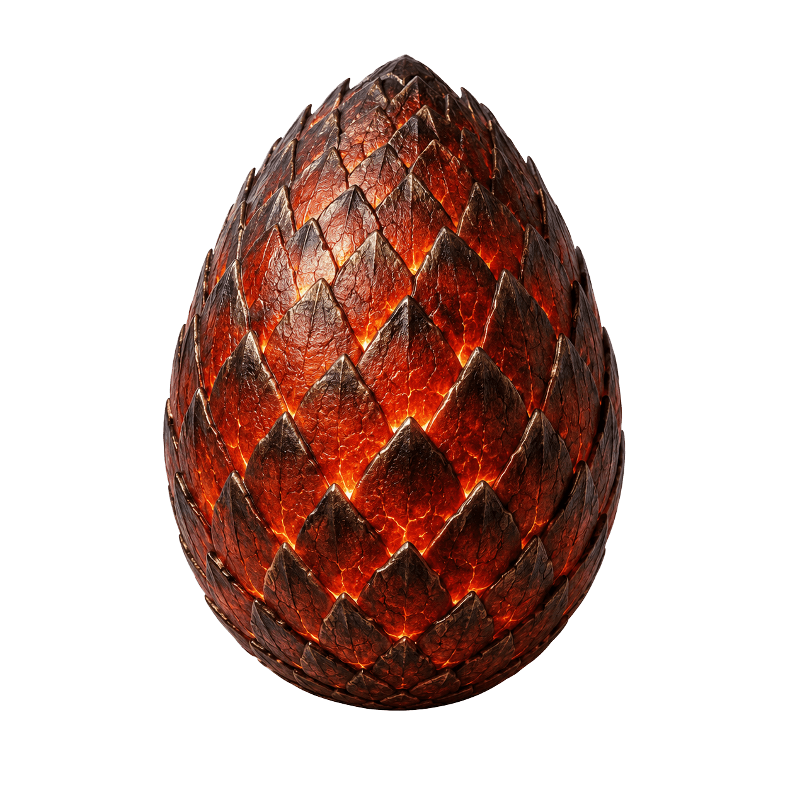

# Dragon Companion

Rồng desktop companion — vừa nuôi rồng vừa tăng năng suất làm việc.



## Tính năng

### Tiến hoá Rồng
Trứng → Rồng con → Vị thành niên → Trưởng thành → Cổ đại → Huyền thoại
Mỗi giai đoạn có hình ảnh riêng, mở khoá qua XP tích luỹ.

### Pomodoro Timer
Tích hợp sẵn Pomodoro 25 phút. Rồng đếm ngược cùng bạn, thưởng XP sau mỗi phiên hoàn thành.

### Quản lý Mục tiêu
- `/goal <text>` — Đặt mục tiêu buổi sáng
- `/done <id>` — Đánh dấu hoàn thành (+25 XP)
- `/stats` — Xem thống kê
- Tự động evening review sau 21h

### Chat với Rồng
Click vào rồng → chat. Hỗ trợ Ollama (qwen3:4b) để sinh phản hồi thông minh. Fallback canned responses nếu không có LLM.

### Nhắc nhở Thông minh
- Nghỉ mắt 20-20-20 mỗi 20 phút
- Cảnh báo burnout sau 10h liên tục
- Nhắc đi ngủ sau 23h
- Auto sleep sau 1h sáng

### Achievement & Streak
- 10+ badge: first_goal, pomo_5, streak_7, legend...
- Streak ngày liên tiếp hoàn thành mục tiêu

### Hệ phái
4 hệ: Lửa (mặc định), Băng, Vàng, Bóng tối. Đổi bằng `/element <tên>`.

## Cài đặt

### Cách 1: Portable EXE
Tải file `DragonCompanion.exe` từ Releases, chạy luôn. Không cần Python.

### Cách 2: Từ Source
```bash
pip install PyQt6 pywin32 psutil Pillow
python dragon_app.py
```

## Lệnh Chat

| Lệnh | Mô tả |
|---|---|
| `/goal <text>` | Thêm mục tiêu hôm nay |
| `/done <id>` | Hoàn thành mục tiêu |
| `/stats` | Thống kê (LV, XP, pomo, achievements) |
| `/element <fire/ice/gold/shadow>` | Đổi hệ phái |
| `focus` / `tập trung` | Rồng động viên (+2 XP) |
| `ngủ` / `sleep` | Rồng đi ngủ |

## Tech Stack
- **Python 3.12** + **PyQt6** — GUI desktop
- **SQLite** — Local-first storage (%APPDATA%)
- **Ollama API** — LLM chat (optional)
- **PyInstaller** — Build EXE standalone

## License
MIT — thoải mái share, sửa, phân phối lại.
